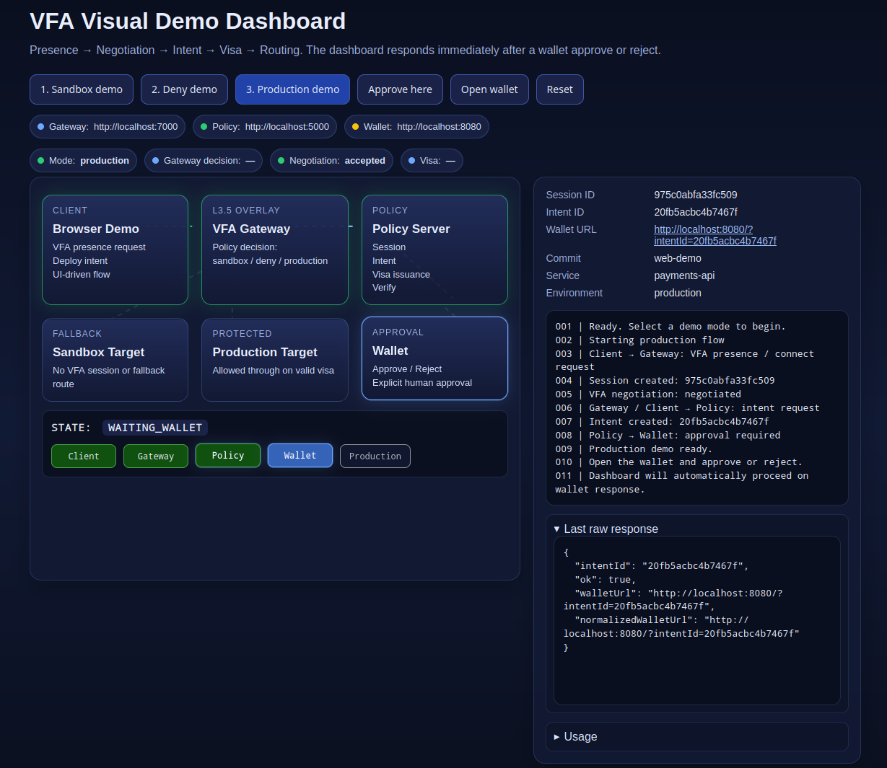

# VFA-cloud-PoC

Proof-of-concept implementation of Virtual Flow Agreement (VFA) applied to cloud operations — verifying user intent before critical actions such as production deployments.

> VFA-cloud-PoC demonstrates how critical cloud operations can be protected
> by verifying user intent before execution using the Virtual Flow Agreement protocol.


⚠ Research prototype — not production-ready. See [SECURITY.md](SECURITY.md).

---

## Concept

VFA introduces a **verification layer between intent and execution**.

Before a sensitive action (for example a production deployment) can proceed,
the system performs a multi-entity verification handshake:

```
Client → Gateway → Policy → Wallet → Policy → Gateway → Production
```

Only after the wallet confirms the intent and the policy server issues a
**signed visa token** does the gateway allow the operation.

The gateway acts as an **L3.5 policy overlay** — a decision plane sitting
logically between IP routing and application processing, enforcing policy
before any backend executes.

---

## Repositories

- **VFA-cloud-PoC** — this repository: cloud operation PoC (deployment scenario)
- **VFA-Spec** — protocol specification → https://github.com/Csnyi/VFA-Spec
- **VFA-MVP** — wallet / merchant handshake reference implementation → https://github.com/Csnyi/VFA-MVP
- **VFA-Lab** — gateway routing architecture sandbox → https://github.com/Csnyi/VFA-Lab

---

## Demo flow

Scenario implemented in this PoC: **wallet-approved production deployment**.

1. Client sends a deployment request to the gateway
2. Gateway initiates VFA negotiation with the policy server
3. Policy server creates a signed intent
4. Wallet displays the intent for user review
5. User approves or rejects
6. Policy server issues a short-lived visa token on approval
7. Gateway verifies the token and its bindings, then routes to production or denies

Three demo modes are available:

| Mode | Description |
|------|-------------|
| **Sandbox** | No VFA session — gateway routes to sandbox fallback |
| **Deny** | VFA session exists but no visa token — gateway blocks the request |
| **Production** | Full flow — wallet approval issues a visa token, gateway routes to production |

---

## Components

| Service | Role | Port |
|---------|------|------|
| `policy-server` | Session management, intent lifecycle, visa token issuance and verification | 5000 |
| `vfa-gateway` | Policy enforcement: routes to production, sandbox, or deny | 7000 |
| `deploy-target` | Protected production backend | 5001 |
| `sandbox-target` | Fallback backend for unauthenticated requests | 5002 |
| `wallet` | Browser UI: user reviews and approves/rejects intents | 8080 |

---

## Requirements

- Docker Engine 24+
- Docker Compose V2
- A modern browser (for the wallet and demo dashboard)

---

## Quick start

### 1. Configure environment

```bash
cp .env.example .env
# Edit .env and set VFA_HMAC_SECRET to a strong random value
```

### 2. Build and start

```bash
docker compose up -d --build
```

### 3. Open the demo dashboard

```
http://localhost:8080/demo.html
```

The dashboard provides three demo mode buttons and a live protocol flow visualizer.

### 4. Open the wallet (for the production demo)

When running the production demo, the dashboard will display a wallet URL.
Open it in a new browser tab:

```
http://localhost:8080/index.html?intentId=<intentId>
```

Or click **Open wallet** on the dashboard.

### 5. Run the CLI demo (optional)

```bash
# Production flow (requires manual wallet approval step)
sh demo-client/run_demo.sh prod

# Sandbox routing (no VFA session)
sh demo-client/run_demo.sh sandbox

# Deny routing (VFA session but no visa)
sh demo-client/run_demo.sh deny
```

---

## Health checks

```bash
curl http://localhost:5000/health   # policy-server
curl http://localhost:7000/health   # vfa-gateway
curl http://localhost:5001/health   # deploy-target
curl http://localhost:5002/health   # sandbox-target
```

---

## Documentation

| Document | Description |
|----------|-------------|
| [docs/ARCHITECTURE.md](docs/ARCHITECTURE.md) | Component overview, protocol flow, data model, token format |
| [SECURITY.md](SECURITY.md) | Known limitations and production hardening checklist |
| [CONTRIBUTING.md](CONTRIBUTING.md) | How to contribute |

---

## Motivation

Modern infrastructure automation allows extremely powerful operations to be
triggered with minimal friction. The VFA model explores an alternative:
critical operations require **explicit, cryptographically verifiable human
intent confirmation** before execution.

Potential use cases include production deployments, infrastructure changes,
financial operations, API access control, and privileged operations — anywhere
that silent authorization is an unacceptable risk.

---

## Project status

Research prototype / proof of concept.

This repository focuses on **visualizing and validating the VFA protocol flow**.
It is not a production-ready security implementation. See [SECURITY.md](SECURITY.md)
for the full list of known limitations and what a production deployment would require.

⚠ Do NOT use in production.

---

## License

Apache-2.0 — see [LICENSE](LICENSE).

---

## Demo screenshot

