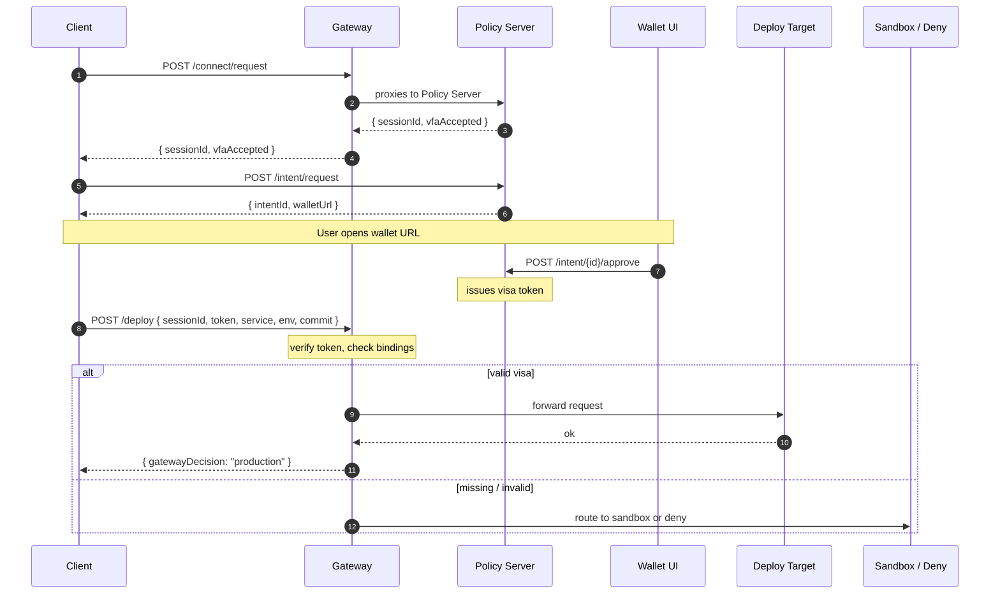

# Architecture: VFA Cloud PoC

## Goal

Demonstrate the VFA protocol flow applied to a cloud operation (deployment)
where a sensitive action may only proceed after explicit, wallet-mediated
human approval and cryptographic verification.

---

## Components

| Service | Role | Port |
|---------|------|------|
| `policy-server` | Session management, intent lifecycle, visa token issuance and verification | 5000 |
| `vfa-gateway` | Policy enforcement — routes requests to production, sandbox, or deny | 7000 |
| `deploy-target` | Protected production backend; accepts only gateway-forwarded requests | 5001 |
| `sandbox-target` | Fallback backend; receives unauthenticated or rejected requests | 5002 |
| `wallet` | Browser UI served by nginx; user reviews and approves/rejects intents | 8080 |

---

## Protocol flow



### Gateway routing decisions

| Condition | Decision |
|-----------|----------|
| No session ID in request | `sandbox` |
| Unknown session ID | `sandbox` |
| Session exists, VFA not accepted | `sandbox` |
| Session accepted, no visa token | `deny` (403) |
| Token present, signature invalid / expired / replayed | `deny` (403) |
| Token valid, audience mismatch | `deny` (403) |
| Token valid, session / service / env / commit mismatch | `deny` (403) |
| Token valid, all bindings match | `production` |

---

## Data model (in-memory)

### Sessions (`SESSIONS` dict in policy-server)

```
sessionId       string   unique session identifier
clientId        string   requesting client
target          string   intended target service
vfaRequested    bool     whether client requested VFA
vfaAccepted     bool     whether VFA was negotiated successfully
status          string   negotiated | fallback
createdAt       int      Unix timestamp
expiresAt       int      Unix timestamp
```

### Intents (`INTENTS` dict in policy-server)

```
intentId        string   unique intent identifier
sessionId       string   parent session
intent          string   operation type (e.g. "deploy")
service         string   target service name
env             string   target environment
commit          string   commit hash / identifier
requestedBy     string   requesting party
status          string   pending | approved | rejected
approvedBy      string   wallet user identifier (set on approval)
approvedAt      int      Unix timestamp (set on approval)
tokenId         string   issued visa token ID (set on approval)
```

### Visa Tokens (`TOKENS` dict in policy-server)

```
tokenId         string   unique token identifier
intentId        string   parent intent
sessionId       string   parent session
token           string   signed token string (payload_b64.sig_b64)
createdAt       int      Unix timestamp
expiresAt       int      Unix timestamp
revoked         bool     revocation flag
```

---

## Visa token format (PoC)

```
base64url(JSON payload) + "." + base64url(HMAC-SHA256(secret, payload_b64))
```

Payload fields:

| Field | Meaning |
|-------|---------|
| `tokenId` | unique token identifier |
| `iss` | issuer (`vfa-policy-server`) |
| `sub` | subject (`deploy-operation`) |
| `aud` | intended audience (`vfa-gateway`) |
| `sessionId` | bound session |
| `intentId` | bound intent |
| `intent` | operation type |
| `env` | bound environment |
| `service` | bound service |
| `commit` | bound commit |
| `requestedBy` | originating client |
| `approvedBy` | wallet user who approved |
| `iat` | issued-at (Unix seconds) |
| `exp` | expiration (Unix seconds) |

> **Note:** HMAC-SHA256 with a shared secret is used here for simplicity.
> Production deployments must use asymmetric signing (Ed25519 or ECDSA P-256).
> See [SECURITY.md](../SECURITY.md) for the full production requirements.

---

## Wallet ↔ Dashboard communication

The wallet UI and the demo dashboard run in separate browser tabs.
They communicate via two mechanisms (in priority order):

1. **BroadcastChannel** (`vfa-demo`) — instant, same-origin tab messaging
2. **localStorage polling** (`vfa-wallet-last-result`) — fallback for cases
   where BroadcastChannel is not available or tabs were opened at different times

Both mechanisms carry the same payload:

```json
{
  "type": "vfa-wallet-approved",
  "intentId": "...",
  "sessionId": "...",
  "token": "...",
  "payload": { ... },
  "source": "wallet-ui",
  "sentAt": 1710000000000
}
```

---

## L3.5 overlay concept

The gateway acts as a **policy decision plane** sitting logically between
IP routing and application processing — the "L3.5" concept from VFA-Spec.

In this PoC, enforcement happens at the HTTP layer after TLS termination.
The longer-term vision (TLS handshake extension, sidecar proxy) is described
in [VFA-Spec / docs/FUTURE.md](https://github.com/Csnyi/VFA-Spec/blob/main/docs/FUTURE.md).

---

## Known gaps (PoC scope)

- No replay protection (nonce deduplication not implemented)
- Sessions and tokens are in-memory only (lost on restart)
- No key rotation or `kid` support
- Token TTL is 300 s by default (VFA-Spec recommends ≤ 60 s for production)
- CORS is fully open for local development convenience
